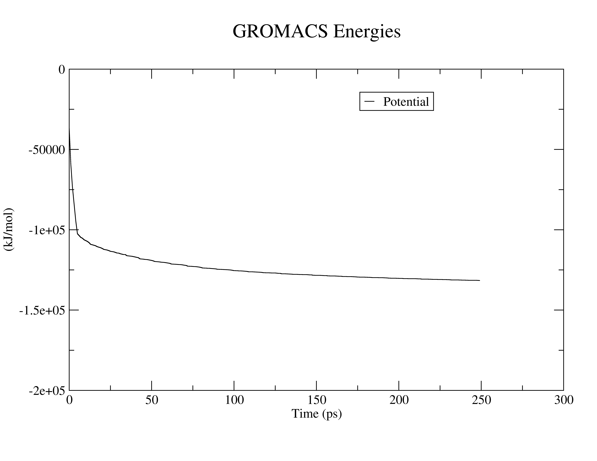
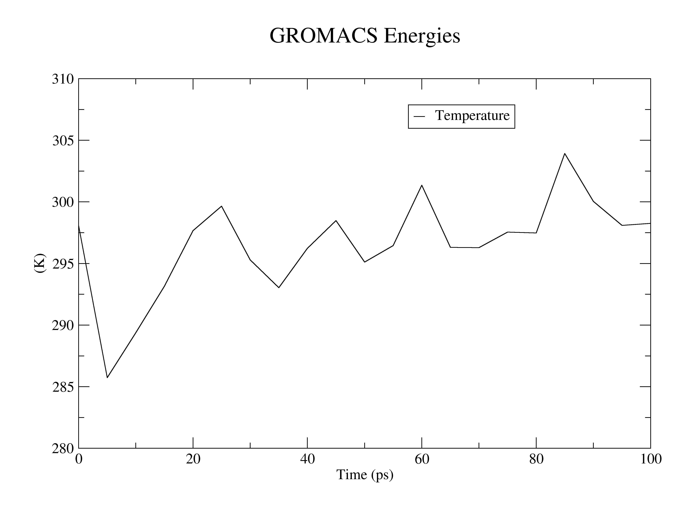
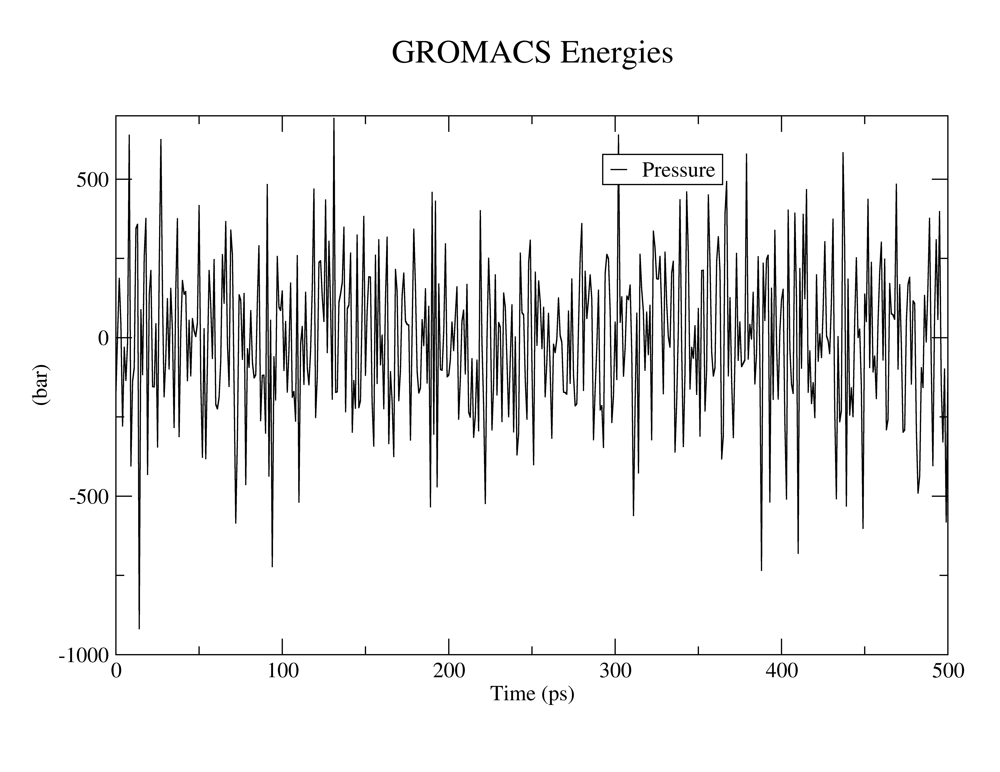

# GROMACS Test System: Chignolin

This repository contains a simple GROMACS workflow for simulating the Chignolin peptide (PDB ID: 5AWL). The workflow includes system preparation, solvation, ion addition, energy minimization, and production run.

---

## 1. Access compute node

First, access a short compute node and load GROMACS:

```bash
srun --pty -p short -c 32 --time=03:00:00 bash
module load gromacs
```

---

## 2. Generate topology

Generate the processed structure and topology using `pdb2gmx`.

Here we use TIP3P water and AMBER03 force field for protein with AMBER94 nucleic parameters (Duan et al., *J. Comput. Chem.* **24**, 1999–2012, 2003).

```bash
gmx pdb2gmx -f 5AWL.pdb -o protein_processed.gro -water tip3p
```
> When prompted, select **1 "AMBER03 protein, nucleic AMBER94"**.

### Input
- `5AWL.pdb` : Initial protein structure

### Output
- `protein_processed.gro` : Processed structure
- `topol.top` : Topology file
- `posre.itp` : Position restraints

---

## 3. Define unit cell & solvate system

### Create simulation box

```bash
gmx editconf -f protein_processed.gro -o protein_newbox.gro -c -d 1.0 -bt cubic
```

### Add solvent

```bash
gmx solvate -cp protein_newbox.gro -cs spc216.gro -o protein_solv.gro -p topol.top
```

### Output
- `protein_newbox.gro` : Boxed system
- `protein_solv.gro` : Solvated system
- Updated `topol.top`

---

## 4. Add ions

Prepare ion input file:

```bash
gmx grompp -f input/ions.mdp -c protein_solv.gro -p topol.top -o ions.tpr
```

Insert ions:

```bash
gmx genion -s ions.tpr -o protein_solv_ions.gro -p topol.top -pname NA -nname CL -neutral
```

> When prompted, select **group 13 "SOL"**.

### Output
- `protein_solv_ions.gro` : Neutralized system
- Updated `topol.top`
- `ions.tpr`

---

## 5. Energy minimization

Before running dynamics, minimize the system to remove bad contacts.

### Run minimization

```bash
gmx grompp -f input/minim.mdp -c protein_solv_ions.gro -p topol.top -o em.tpr
gmx mdrun -deffnm em -ntmpi 4 -ntomp 4 -v
```

### Analyze energy

```bash
gmx energy -f em.edr -o potential.xvg
```

At the prompt:

```bash
10 0
```

- `10` → Potential energy
- `0` → Exit

### Output
- `em.gro` : Minimized structure
- `em.edr` : Energy file
- `potential.xvg` : Energy profile

### Potential energy plot



---
## 6. Equilibration

Energy minimization provides a relaxed starting structure, but the system is not yet ready for production dynamics. The solvent and ions must be equilibrated around the protein.

If unrestrained dynamics are performed at this stage, the system may become unstable because the solvent is not yet properly adapted to the solute. Therefore, equilibration is performed to gradually bring the system to the desired temperature and stabilize interactions.

Equilibration is typically done in two phases:
- **NVT (constant Number of particles, Volume, Temperature)** → temperature stabilization  
- **NPT (constant Number of particles, Pressure, Temperature)** → density/pressure stabilization  

---

## 6.1 NVT equilibration

### Prepare input file

```bash
gmx grompp -f input/nvt.mdp -c em.gro -r em.gro -p topol.top -o nvt.tpr
```

### Run equilibration

```bash
gmx mdrun -deffnm nvt -v -ntmpi 4 -ntomp 4
```

---

## 6.2 Temperature analysis

Analyze temperature stability using the energy module:

```bash
gmx energy -f nvt.edr -o temperature.xvg
```

### Interactive selection
At the prompt, enter:

```bash
16 0
```

- `16` → Temperature of the system  
- `0` → Exit selection  

---

## Output
- `nvt.tpr` : Input file for simulation  
- `nvt.gro` : Equilibrated structure  
- `nvt.edr` : Energy file  
- `temperature.xvg` : Temperature evolution  

---

## Temperature plot



## 7. NPT Equilibration

After completing the NVT step, the system temperature is stabilized. The next step is to stabilize the pressure and density of the system before production dynamics.

This is done using the **NPT ensemble (constant Number of particles, Pressure, and Temperature)**, also known as the isothermal–isobaric ensemble. This ensemble closely resembles experimental conditions.

---

## 7.1 Run NPT equilibration

### Prepare input file

```bash
gmx grompp -f input/npt.mdp -c nvt.gro -r nvt.gro -t nvt.cpt -p topol.top -o npt.tpr
```

### Run simulation

```bash
gmx mdrun -deffnm npt
```

---

## 7.2 Pressure analysis

Analyze pressure fluctuations using the GROMACS energy module:

```bash
gmx energy -f npt.edr -o pressure.xvg
```

### Interactive selection
At the prompt, enter:

```bash
16 0
```

- `17` → Pressure of the system  
- `0` → Exit selection  

---

## Output
- `npt.tpr` : Input file for NPT run  
- `npt.gro` : Equilibrated structure  
- `npt.cpt` : Checkpoint file  
- `npt.edr` : Energy file  
- `pressure.xvg` : Pressure evolution  

---

## Pressure plot



## 8. Production Molecular Dynamics (MD)

After completing both equilibration steps (NVT and NPT), the system is fully equilibrated at the desired temperature and pressure. At this stage, position restraints are removed and the system is ready for **production MD**, where data is collected for analysis.

Here, we perform a **1 ns molecular dynamics simulation**.

---

## 8.1 Prepare MD input

```bash
gmx grompp -f input/md.mdp -c npt.gro -t npt.cpt -p topol.top -o md_0_1.tpr
```

---

## 8.2 Run production MD

```bash
gmx mdrun -deffnm md_0_1
```

---

## Output files

- `md_0_1.tpr` : Input file for production MD  
- `md_0_1.xtc` : Trajectory file  
- `md_0_1.gro` : Final structure  
- `md_0_1.edr` : Energy file  
- `md_0_1.log` : Log file  
- `md_0_1.cpt` : Checkpoint file  

---

## Notes

- This step generates the trajectory used for all downstream analysis.
- Ensure sufficient sampling time depending on the system (1 ns is used here for a test run).
```
### Performance Summary

For a **1 ns MD simulation**, the performance statistics were:

```
Core time (s)   : 11223.211
Wall time (s)   : 701.506
Parallel efficiency (%) : 1599.9

Performance:
(ns/day)        : 123.164
(hour/ns)       : 0.195
```

### Interpretation

- **ns/day = 123.164**  
  → The simulation speed is ~123 nanoseconds per day of wall-clock time.

- **hour/ns = 0.195**  
  → Each nanosecond of simulation takes ~0.195 hours (~11.7 minutes).

### Note

- Performance depends on system size, force field, CPU architecture, and MPI/OpenMP balance (`-ntmpi 4 -ntomp 4` in this case).
- This benchmark indicates a highly efficient run for a small system like Chignolin.
